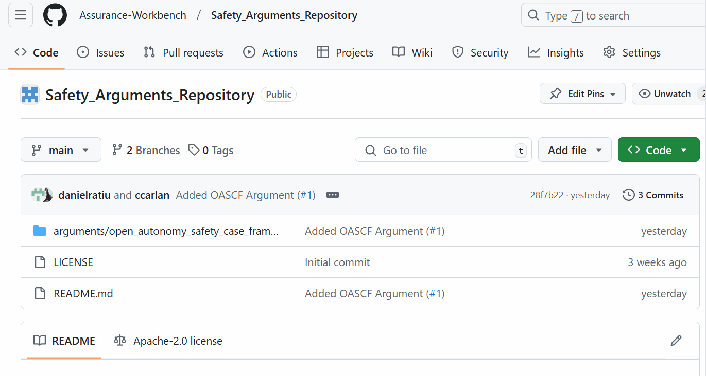
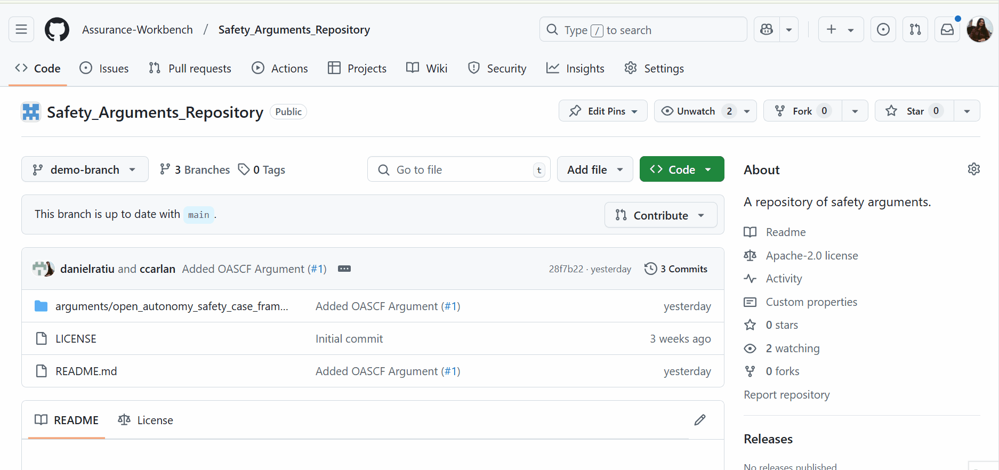
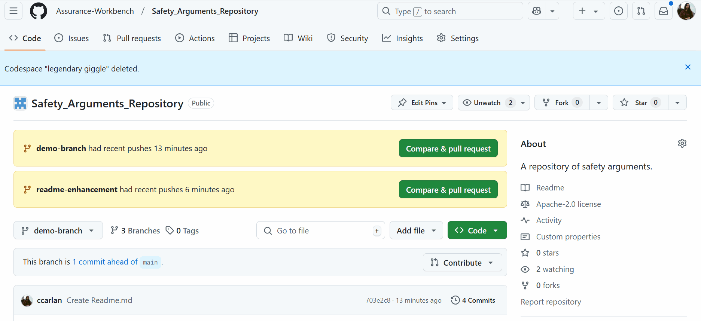
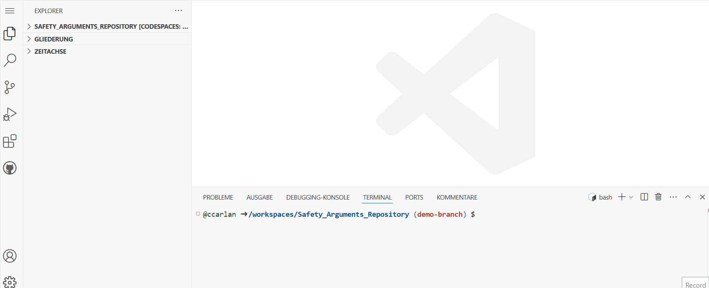
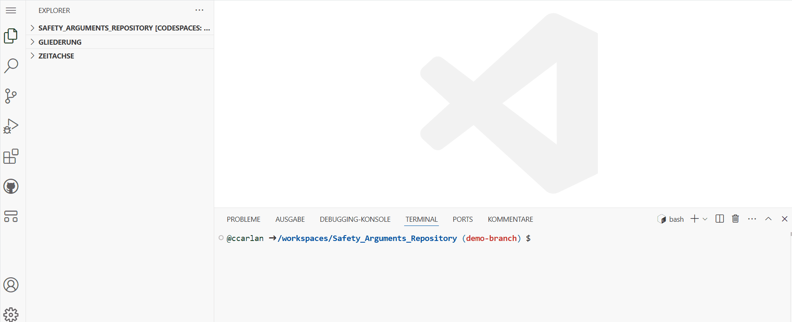
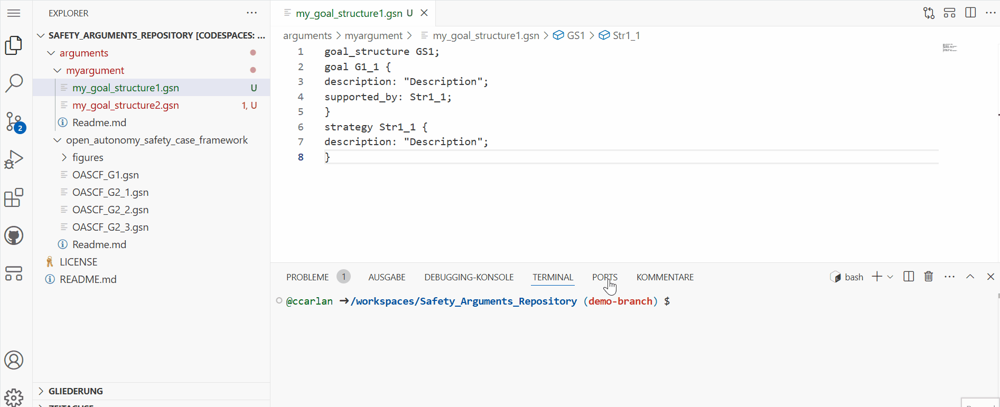
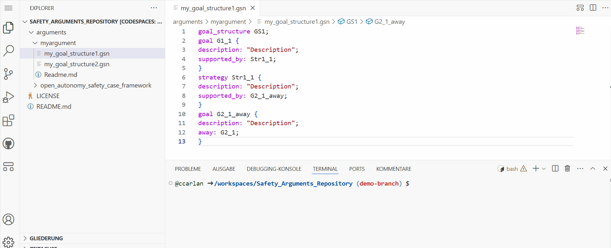
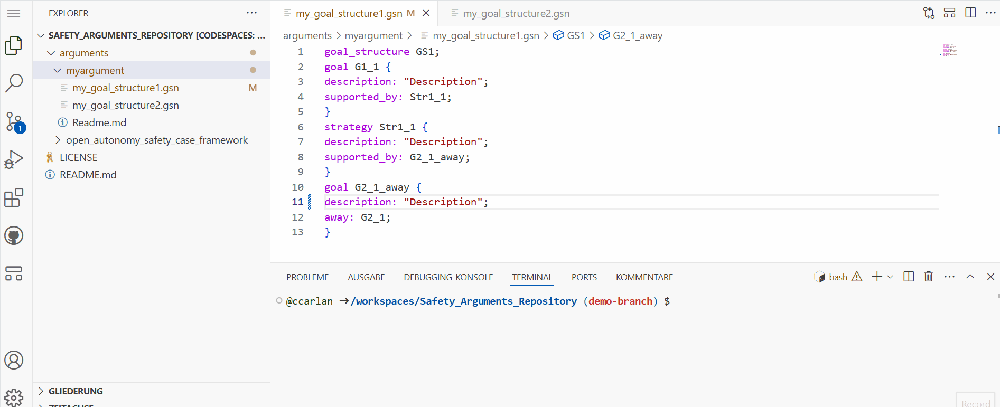

# Safety Arguments Repository
A repository of safety arguments:

- [Open Autonomy Safety Case Framework](./arguments/open_autonomy_safety_case_framework)

## How to Add a Safety Argument to the Repository

1. Optionally, clone the repository on your local machine.
2. Create a new branch to the repository either locally or directly on github. In this branch, you will add your argument.

3. In the newly created branch, add a folder with a _Readme.md_ file. The folder should be under the _arguments_ parent folder. For example,  _arguments/myargument_. After creating the new folder, commit the changes.

4. Create a new codespace in the github cloud. An IDE for VSCode will open with the _Safety Arguments Repository_ project. Alternatively, if you are working on  on your local machine, open the project in VSCode IDE. There, you will also find your newly created folder. Once you created a codespace, you can access it whenever you want.

5. Install the Goal Structuring Notation extension in the codespace/in your IDE.

6. Add a new gsn file to your folder and specify your argument in the gsn file.
  - Define a new goal structure, at the begining of the file, using: `goal_structure <goal_structure_name>;`
  - Define the goal structure elements, using: `<element_type> <element_name> {description: "<element description>";}`. For example:
    `goal G1 {
    description: "Our autonomous driver is safe enough to deploy";
    }`
  - Specify relationships between the goal structure elements, adding to an element the following: `supported_by: <name_of_the_supporting_element>;` or `in_context_of: <name_of_the_context_element>;`. For example:
    `goal G1 {
    description: "Our autonomous driver is safe enough to deploy";
    supported_by: S1;
    }`.
  
  - Reference elements in other diagrams from elements in the current diagram via the _away_ attribute. For example: `strategy Str1_1 {
description: "Description";
supported_by: G2_1_away;
}
goal G2_1_away {
description: "Description";
away: G2_1;
}`

7. Open the diagram.

8. Commit and push the changes to your branch.

9. Edit your argument as many times as you want. Don't forget to commit your changes!
10. Before publishing your argument to the Safety Arguments Repository, edit the _Readme.md_ file in the folder of the argument. In this file, you can add a bit of information about the argument you specified. For example: where it was first published, its main goal, or how and when it could be used in a safety case. You can take inspiration from the Readme files of other arguments in the repository.
11. Create a merge request. Your contriution will be then reviewed and will either be merged into the main branch, or you will receive some recommendation for improvement.

